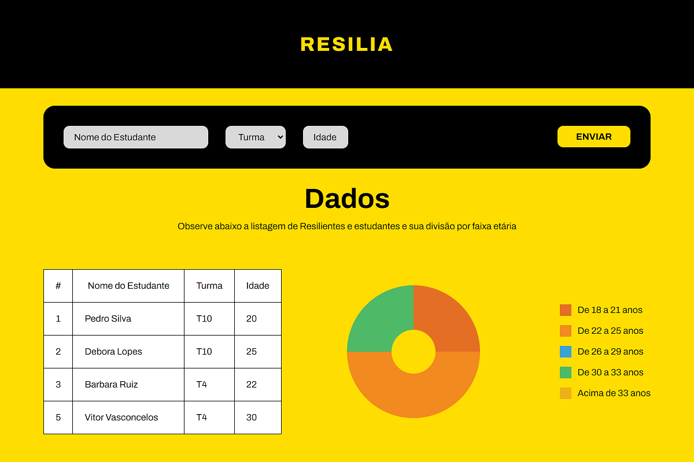
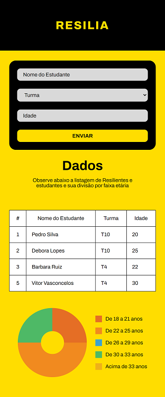

# Challenge Week 2022

Entrada para o Challenge Week 2022 da Resilia.

O projeto consiste em um sistema de registro de estudantes, realizando a comunicação entre um banco de dados, o servidor interno local e o front-end da aplicação.

     

## 🤳 Layout

| Desktop                       | Mobile                       |
| ----------------------------- | ---------------------------- |
|  |  |

## 🌎 Endpoints (API)

| Método   | Endpoint      | Descrição                                  |
| -------- | ------------- | ------------------------------------------ |
| `GET`    | `/`           | Retorna informações de todos os registros. |
| `GET`    | `/:id`        | Retorna informações de apenas um registro. |
| `POST`   | `/new`        | Criação de um novo registro.               |
| `DELETE` | `/delete/:id` | Remove um registro do sistema.             |

## 📥 Instalação

1. Instale o [Node.js](https://nodejs.org/en/).

2. Faça o download como ZIP clicando neste [link](https://github.com/C836/Challenge-Week/archive/refs/heads/main.zip) e extraia a pasta no local de sua preferência ou siga o passo a passo para fazer a instalação através do terminal do [Git:](https://git-scm.com/)

```bash
# Navegue pelos arquivos com o comando "cd" e faça o download do projeto

# Via SSH
$ git clone git@github.com:C836/Challenge-Week.git
# ou via HTTPS
$ git clone https://github.com/C836/Challenge-Week.git

# Após o download, entre na pasta raiz da aplicação
$ cd Challenge-Week
```

3. O projeto armazena as cartas e resultados por meio do [MongoDB](https://www.mongodb.com/cloud). Edite o arquivo [.env](https://github.com/C836/Challenge-Week/blob/main/.env_example) na raiz da aplicação, de acordo com seu usuário e senha. Ao iniciar a aplicação, a conexão será feita automaticamente.

```bash
# URL de conexão:
# mongodb+srv://<USUARIO>:<SENHA>@<CLUSTER>/<OPTIONS>

BACKEND_PORT=3300
VITE_API=3300
## PRECISAM SER IGUAIS

VITE_PORT=3400
## FRONTEND

DB_USER=##
DB_PASSWORD=##
DB_CLUSTER=##
DB_NAME="rsweek"
## CONFIGURAÇÕES DO BANCO DE DADOS
```

4. Navegue em ambos os diretórios (front-end e back-end), instale as dependências necessárias de cada e inicie a aplicação.

```bash
$ npm install

$ npm start

## faça isso nos dois diretórios!
```

## 📝 Licença

<b>Copyright (c) 2022 Gabriel Lopes</b>

Esse projeto está sob a licença MIT. Veja o arquivo [LICENSE](https://github.com/C836/Pokemon-Cards/blob/main/LICENSE) para mais detalhes.
